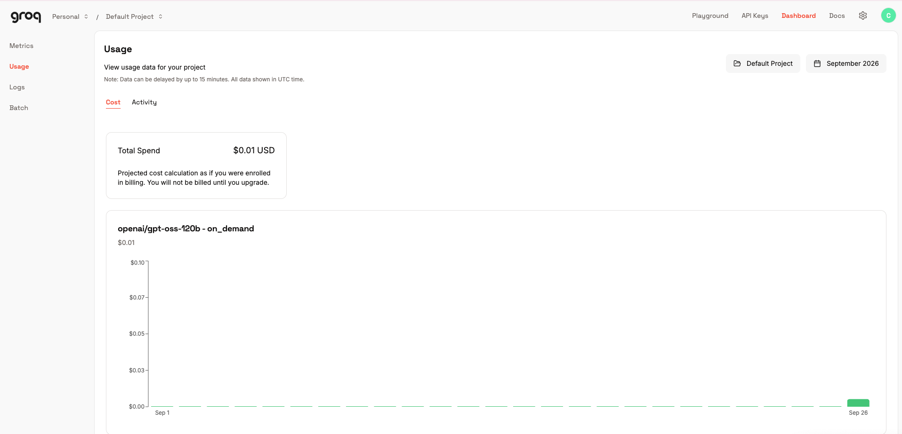

# Perbandingan Model Klasifikasi Sentimen: Model Klasik (Scikit-learn) vs LLM API (Groq)

## 1. Problem Statement & Dataset

### Problem Statement
Proyek ini bertujuan membandingkan dua pendekatan untuk mengklasifikasikan **sentimen ulasan produk** ke dalam dua kelas: **positif** atau **negatif**. Dua pendekatan yang dibandingkan:

1. **Model Klasik** — machine learning tradisional (Scikit-learn) yang dilatih pada data berlabel.
2. **LLM API** — memanfaatkan Large Language Model (Groq / opsional Gemini) secara zero-shot tanpa proses training, hanya melalui perancangan prompt.

Tujuan akhirnya adalah menentukan pendekatan mana yang lebih sesuai dipakai secara teknis, dengan mempertimbangkan akurasi, kecepatan, biaya, dan effort implementasi.

### Dataset
Dataset berupa kumpulan ulasan produk dengan struktur berikut:

| Kolom          | Tipe   | Keterangan                          |
|----------------|--------|--------------------------------------|
| `review_id`    | int64  | ID unik ulasan                       |
| `product_name` | str    | Nama produk yang diulas              |
| `review_text`  | str    | Teks ulasan pelanggan                |
| `sentiment`    | str    | Label target: `positif` / `negatif`  |

**Ringkasan data:**
- Total data: **200 baris**, tanpa missing value dan tanpa duplikat teks.
- Distribusi label keseluruhan: **positif 110 (55%)**, **negatif 90 (45%)**.
- Split train/test: **160 data training / 40 data test**, dengan distribusi label yang konsisten di kedua split (55% positif / 45% negatif) — sehingga tidak ada indikasi ketidakseimbangan kelas yang ekstrem antar split.

## 2. Ringkasan Eksperimen

### Pendekatan 1 — Model Klasik (Scikit-learn)
- Data teks diproses melalui pipeline preprocessing standar (cleaning, vektorisasi TF-IDF/BoW).
- Model dilatih pada 160 data training menggunakan algoritma klasifikasi Scikit-learn (mis. Naive Bayes/SVM/Logistic Regression — sesuaikan dengan model yang dipakai).
- Prediksi dilakukan pada 40 data test.

### Pendekatan 2 — LLM API (Groq, opsional Gemini (TERKENDALA LIMITASI))
- Tidak ada proses training — klasifikasi dilakukan secara **zero-shot** melalui prompt yang meminta model menjawab hanya dengan satu kata (`positif`/`negatif`).
- API key disimpan melalui environment variable (bukan hardcoded).
- Output LLM dinormalisasi (lowercase, strip whitespace, deteksi kata kunci) sebelum dibandingkan dengan label asli.
- Hasil normalisasi: **0 output `unknown`** dari 40 data test, artinya seluruh output LLM berhasil dipetakan dengan bersih ke salah satu dari dua label.

## 3. Tabel Hasil Evaluasi dan Perbandingan

| Metrik    | Model Klasik (Scikit-learn) | LLM API (Groq) |
|-----------|:---------------------------:|:--------------:|
| Accuracy  | 1.00                         | 1.00            |
| Precision | 1.00                         | 1.00            |
| Recall    | 1.00                         | 1.00            |
| F1-Score  | 1.00                         | 1.00            |

**Confusion Matrix — Model Klasik**
```
[[18  0]
 [ 0 22]]
```

**Confusion Matrix — LLM API (Groq)**
```
[[18  0]
 [ 0 22]]
```

Kedua pendekatan mengklasifikasikan seluruh 40 data test dengan benar (18/18 negatif, 22/22 positif), tanpa satu pun kesalahan.

> ⚠️ **Catatan penting**: Skor sempurna (1.0) pada kedua pendekatan yang arsitekturnya sangat berbeda kemungkinan besar disebabkan oleh **ukuran dataset yang kecil (200 baris)** dan **karakteristik teks ulasan yang relatif eksplisit** (sinyal sentimen mudah dikenali), bukan bukti bahwa kedua model akan selalu sempurna pada data dunia nyata yang lebih besar dan beragam. Lihat Bagian 4 untuk detail analisis.

## 4. Analisis Trade-off dan Limitation

### Performa
Pada eksperimen ini, kedua pendekatan setara sempurna sehingga belum ada perbedaan performa yang bisa dibedakan. Perbedaan yang lebih realistis kemungkinan baru terlihat pada dataset yang lebih besar dan lebih menantang (ulasan ambigu, sarkasme, sentimen campuran).

### Effort & Kompleksitas Implementasi
| Aspek | Model Klasik | LLM API |
|---|---|---|
| Perlu training | Ya (preprocessing + fitting) | Tidak (hanya prompt design) |
| Effort awal | Lebih besar | Lebih kecil |
| Perlu data berlabel dalam jumlah besar | Ya | Tidak wajib |
| Konsistensi output | Selalu terstruktur | Perlu normalisasi tambahan |

### Kecepatan
- **Model Klasik**: prediksi instan (milidetik) karena inferensi berjalan lokal.
- **LLM API**: setiap prediksi butuh 1 request ke server eksternal, jauh lebih lambat untuk data dalam volume besar, dan rentan terhadap rate limit.

### Biaya
- **Model Klasik**: gratis setelah training, hanya biaya komputasi lokal.
- **LLM API**: biaya per token/request, membesar linier seiring volume data yang diproses.


### Keterbatasan Masing-Masing

**Model Klasik:**
- Sangat bergantung pada kualitas dan jumlah data training (di sini hanya 160 baris, rawan overfit terhadap pola dataset ini saja).
- Tidak bisa menangani kosakata atau gaya bahasa baru yang tidak muncul saat training.

**LLM API:**
- Bergantung pada koneksi internet dan ketersediaan layanan pihak ketiga.
- Risiko privasi jika data ulasan bersifat sensitif dan dikirim ke server eksternal.
- Skor sempurna di sini belum menguji ketahanan LLM terhadap teks yang benar-benar ambigu.

**Keterbatasan bersama:**
- Dataset (200 baris, 40 data test) terlalu kecil untuk menyimpulkan performa yang dapat digeneralisasi. Diperlukan pengujian pada dataset yang jauh lebih besar dan beragam sebelum kesimpulan performa dapat dipercaya sepenuhnya.

## 5. Rekomendasi Technical Approach

Mengingat skor evaluasi saat ini identik (1.0) pada dataset kecil dan kemungkinan besar belum mencerminkan performa sesungguhnya di dunia nyata, rekomendasi berikut diberikan dengan catatan bahwa **validasi lanjutan pada dataset yang lebih besar sangat disarankan**:

1. **Untuk volume tinggi dan biaya operasional rendah**: gunakan **Model Klasik**, karena setelah dilatih, biaya inferensinya sangat rendah dan cepat — cocok untuk produksi skala besar (ribuan ulasan/hari).
2. **Untuk pengembangan cepat atau volume data rendah**: gunakan **LLM API**, karena tidak memerlukan proses training maupun dataset berlabel besar — cocok untuk tahap awal proyek/prototyping.
3. **Pendekatan hybrid (opsional)**: gunakan Model Klasik sebagai lapisan utama, dan panggil LLM API hanya untuk kasus yang model klasik kurang yakin, untuk menyeimbangkan biaya dan akurasi.
4. **Sebelum adopsi permanen**: perbesar dan variasikan dataset (idealnya >1.000 baris dengan sentimen campuran, sarkasme, dan bahasa informal), lalu uji ulang kedua pendekatan pada data out-of-sample untuk mendapatkan gambaran performa yang lebih realistis.

## 6. Cara Menjalankan Notebook/Script

### Prasyarat
- Python 3.12+
- Virtual environment (disarankan)

### Instalasi
```bash
# Buat dan aktifkan virtual environment
python3 -m venv .venv
source .venv/bin/activate      # macOS/Linux

# Install dependencies
pip install -r requirements.txt
# Tambahkan google-genai jika menggunakan Gemini:
# pip install google-genai
```

### Konfigurasi API Key
Simpan API key sebagai environment variable — **jangan hardcode di notebook**:
```bash
export GROQ_API_KEY="your_api_key_here"
# export GEMINI_API_KEY="your_api_key_here"   # jika menggunakan Gemini


### Menjalankan Notebook
```bash
jupyter notebook
```
Buka file notebook utama, lalu jalankan seluruh sel secara berurutan dari atas ke bawah:
1. **Data Cleansing** — memuat dan membersihkan dataset.
2. **Train/Test Split** — membagi data menjadi train (160) dan test (40).
3. **Pendekatan 1 (Model Klasik)** — training dan prediksi menggunakan Scikit-learn.
4. **Pendekatan 2 (LLM API)** — prediksi menggunakan Groq/Gemini API.
5. **Evaluasi dan Perbandingan** — menghitung metrik dan menyusun tabel perbandingan.

### Catatan
- Pastikan koneksi internet aktif untuk langkah LLM API.
- Jika mengalami rate limit dari Groq, tambahkan jeda (`time.sleep()`) antar-request atau kurangi jumlah data yang diproses sekaligus.
